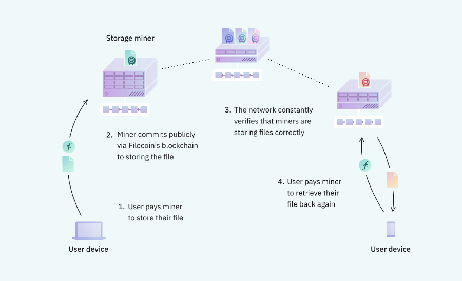

# IPFS

### What is IPFS?

The Interplanetary File System (IPFS) is a distributed, peer-to-peer (p2p) storage network used for storing and accessing files, websites, applications, and data.
Content is accessible from peer nodes located anywhere in the world. These nodes relay information, store it, or both. Some call it the hard drive for blockchain and Web3, though its power extends much further.

IPFS knows how to find data by its contents, not its location. the data are represented by string of numbers i.e (QmXo…), and your computer instead of asking for the data to a centralized server, your computer uses IPFS to ask lots of computers around the world to share the data with you. It can get your desired data from anyone who has it, not just a unique server.

And, when you use IPFS, you don't just download files from someone else — your computer also helps distribute them. When your friend a few blocks away needs the same Wikipedia page, they might be as likely to get it from you as they would from your neighbor or anyone else using IPFS.

IPFS makes this possible for not only web pages but also any kind of file a computer might store, whether it's a document, an email, or even a database record.

Making it possible to download a file from many locations that aren't managed by one organization:
- Supports a resilient internet.
- Makes it harder to censor content.
- Can speed up the web when you're far away or disconnected.

### Content addressing

Identify a file by where it's located (what computer it's on and where on that computer's hard drive it is), that doesn't work if the file is in many places. Instead of being location-based, IPFS addresses a file by what's in it, or by its content. The content identifier is a cryptographic hash of the content at that address. The hash is unique to the content that it came from. The hash is unique to the content that it came from, it also allows you to verify that you got what you asked for — bad actors can't just hand you content that doesn't match. Because the address of a file in IPFS is created from the content itself, links in IPFS can't be changed.

Of course, people want to update and change content all the time and don't want to send new links every time they do it. This is entirely possible in an IPFS world, but explaining it requires a little more info than what's within the scope of this IPFS introduction. Check out the concept guides on [IPNS](https://docs.ipfs.io/concepts/ipns/), the [Mutable File System (MFS)](https://docs.ipfs.io/concepts/file-systems/#mutable-file-system-mfs), and [DNSLink](https://docs.ipfs.io/concepts/dnslink/) to learn more about how changing content can work in a content-addressed, distributed system.

It's important to remember in all of these situations, using IPFS is participatory and collaborative. If nobody using IPFS has the content identified by a given address available for others to access, you won't be able to get it. On the other hand, content can't be removed from IPFS as long as someone is interested enough to make it available, whether that person is the original author or not.

### Participation

Today's World Wide Web is structured on ownership and access, meaning that you get files from whoever owns them — if they choose to grant you access. IPFS is based on the ideas of possession and participation, where many people possess each others' files and participate in making them available. That means IPFS only works well when people are actively participating.

By default, your computer shares a file with others for a limited time after you've downloaded it using IPFS. You can also make content available more permanently by pinning it, which saves it to your computer and makes it available on the IPFS network until you decide to unpin it. Some people have begun offering pinning services based on IPFS. But since IPFS makes this kind of sharing a built-in feature, you can also collaborate with friends or partner with institutions to share each others' files.

### To sum up with

IPFS is great for getting started using content addressing for all sorts of distributed web applications. In the majority of these cases:

- Data is provided by the user’s own nodes. Otherwise, must rely on other peers to voluntarily/altruistically storing data or on a centralized pinning service.
- Centralized IPFS pinning services must be trusted to do their job. IPFS brings no built-in provisions to verify that data is being stored and correctly provided by the pinning service.
- Popular content is more easily accessible. Popular content (with many providers) naturally becomes faster/easier to retrieve in IPFS, which is great when there are external incentives to sync and store data in multiple nodes, and for situations where strong social contracts can be used to ensure the content remains hosted and maintained long-term.

# Filecoin

### What is Filecoin?

Filecoin is a peer-to-peer network that stores files, with built-in economic incentives to ensure files are stored reliably over time.

Storage providers are computers responsible for storing files and proving they have stored the files correctly over time. Anyone who wants to store their files or get paid for storing other users’ files can join Filecoin. Filecoin includes a blockchain and native cryptocurrency (FIL). Storage providers earn units of FIL for storing files.

	

### Relation between IPFS and Filecoin

Filecoin and IPFS are complementary protocols for storing and sharing data in the distributed web. Both systems are free, open-source, and share many building blocks. While interacting with IPFS does not require using Filecoin, all Filecoin nodes are IPFS nodes under the hood, and can connect to and fetch data from other IPFS nodes

IPFS alone does not include a built-in mechanism to incentivize the storage of data for other people. This is the challenge Filecoin aims to solve. Filecoin is built on IPFS to create a distributed storage marketplace for long-term storage. Nodes with a large storage capacity can rent their storage to users and get paid for it.

The Filecoin network ensures that data is safely stored. However, the processes of storing, verifying, and unsealing (referred to as sealing, proving, and retrieving, respectively) are computationally expensive and can take time.

Filecoin aims to add longer-term persistence to safely store large batches of data, while IPFS optimizes for the quick retrieval and distribution of content.

### To sum up with

Filecoin builds on the content addressing of IPFS to add longer term data persistence using cryptoeconomic incentives. With Filecoin:

- Clients make storage deals with storage providers to store data. The network verifies that the storage providers are correctly storing the data. Small payments are made on a regular basis for the duration of the storage deal.
- Storage providers that do not honor the storage deal are penalized.
- Content retrieval might be offered by storage providers directly, or by specialized retrieval storage providers. The user requesting the data pays for this service.
- Filecoin excels at storing large amounts of data for long periods of time.

# Textile

### What is textile?

Textile is a set of open source tools that provide a decentralized database, IPFS-based storage, content hosting, and more over Libp2p, IPFS, and Filecoin.

### Buckets

Buckets are virtual filesystem where you can push, pull, list, and cat files. You can share them via web links or render the whole thing as a website or web app. They also function a bit like a Git repository. The point of entry is from a folder on your local machine that is synced to a remote.

At a lower level, buckets provide a dynamic wrapper around UnixFS directories with auto-updating IPNS, static website rendering, access control, and encryption. Since buckets are just ThreadDB collection instances (see go-threads), they automatically leverage the distributed nature of ThreadDB by allowing multiple identities to write to the same bucket hosted by different Libp2p hosts.

### ThreadDB

ThreadDB is a multi-party database built on IPFS and Libp2p that provides an alternative architecture for data on the web.

ThreadDB aims to help power a new generation of web technologies by combining a novel use of event sourcing, Interplanetary Linked Data (IPLD), and access control to provide a distributed, scalable, and flexible database solution for decentralized applications.

### Powergate

The Powergate is an API-driven solution for deploying multi-tiered storage across Filecoin and IPFS.

By using the Powergate to persist your data on Filecoin, you gain access to rich storage configuration options such as:

- Replication factor
- Miner selection
- Deal renewal
- Repair

Configurable storage is provided through a connected IPFS peer or pinning network.

Since the release of Powervate v2 many of the features and benefits of Powergate have been improved upon by three other technologies.

- Estuary - seamlessly bridge data between IPFS and Filecoin.
- Glif - easily host and manage Filecoin nodes.
- Deal Auctions - migrate large datasets to Filecoin.

### The Hub 

The Hub provides a fast way to use:

- Hosted Buckets and Threads with persistent IPFS endpoints.
- Developer accounts for individuals and organization, with accés control and ownership.
- API key integration into apps.

# Estuary ([estuary.tech](https://estuary.tech/)) 

Estuary automates storage activities with Filecoin. At its core, Estuary is a simple IPFS node that integrates a minimal Filecoin client library. It is an open-source project built by [ARG](https://arg.protocol.ai/) and is available at [github.com/application-research/estuary](https://github.com/application-research/estuary).

Using Estuary users can:

- Store and retrieve content quickly using IPFS.
- Use an IPFS API that adheres to the IPFS Pinning Services API Spec.
- Store content on Filecoin with proposition receipts and successful deal receipts.

Estuary is a great solution for developers and users who want a more accessible interface to store data on Filecoin. See the Estuary documentation to learn more about the project.