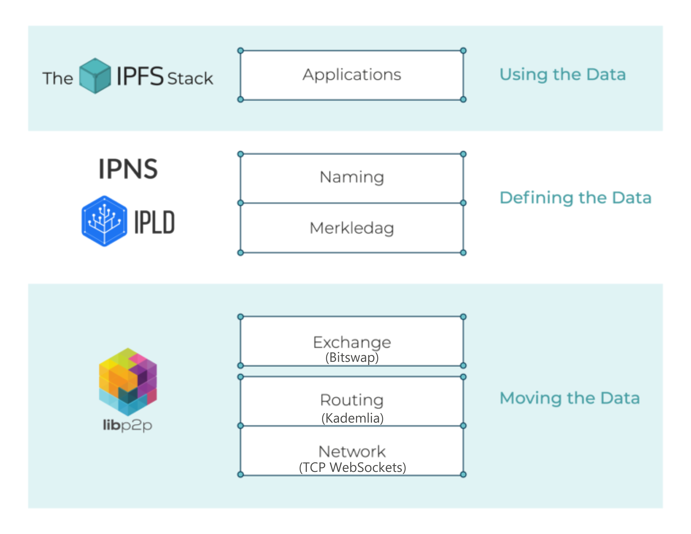
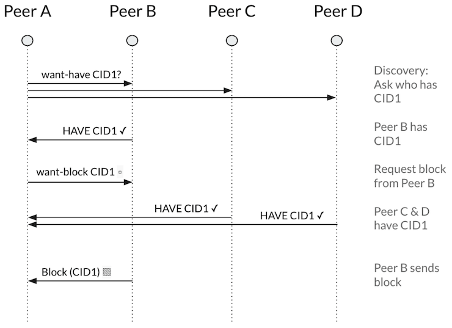

# IPFS under the hood

## Working principles

IPFS is a peer-to-peer (p2p) storage network. Content is accessible through peers located anywhere in the world, that might relay information, store it, or do both. IPFS knows how to find what you ask for using its content address rather than its location.

There are three fundamental principles to understanding IPFS:

- Unique identification via content addressing
- Content linking via directed acyclic graphs (DAGs)
- Content discovery via distributed hash tables (DHTs)

Below is shown a layered abstraction model to understand the technologies involved in IPFS.

<p align="center">
	
</p>

## Content addressing with CIDs

### CIDs

every piece of content that uses the IPFS protocol has a Content IDentifier, or CID.

CIDs are based on the content’s cryptographic hash (sha-256 hashing algorithm by default). That means:

- Any difference in the content will produce a different CID and
- The same content added to two different IPFS nodes using the same settings will produce the same CID.

CIDs can take a few different forms with different encoding bases or CID versions. Many of the existing IPFS tools still generate v0 CIDs, although the files [(Mutable File System)](https://docs.ipfs.io/concepts/file-systems/#mutable-file-system-mfs) and object operations now use CIDv1 by default.

#### Version 0 (v0)

use base 58-encoded multihashes as the content identifiers. This is simpler but much less flexible than newer CIDs. If a CID is 46 characters starting with "Qm", it's a CIDv0, (e.g. QmbWqxBEKC3P8tqsKc98xmWNzrzDtRLMiMPL8wBuTGsMnR).


#### Version 1 (v1)

CID v1 contains some leading identifiers that clarify exactly which representation is used, along with the content-hash itself. These include:

- A multibase prefix, specifying the encoding used for the remainder of the CID.
- A CID version identifier, which indicates which version of CID this is.
- A multicodec identifier, indicating the format of the target content, it helps people and software to know how to interpret that content after the content is fetched.

These leading identifiers also provide forward-compatibility, supporting different formats to be used in future versions of CID.

You can use the first few bytes of the CID to interpret the remainder of the content address and know how to decode the content after being fetched from IPFS.

#### CID structure

A CID v1 has four parts:

```sh
<cidv1> ::= <mb><multicodec-cidv1><mc><mh>
# or, expanded:
<cidv1> ::= <multibase-prefix><multicodec-cidv1><multicodec-content-type><multihash-content-address>
```

Where

- `<multibase-prefix>` is a [multibase](https://github.com/multiformats/multibase) code (1 or 2 bytes), to ease encoding CIDs into various bases. **NOTE:** *Binary* (not text-based) protocols and formats may omit the multibase prefix when the encoding is unambiguous.
- `<multicodec-cidv1>` is a [multicodec](https://github.com/multiformats/multicodec) representing the version of CID, here for upgradability purposes.
- `<multicodec-content-type>` is a [multicodec](https://github.com/multiformats/multicodec) code representing the content type or format of the data being addressed.
- `<multihash-content-address>` is a [multihash](https://github.com/multiformats/multihash) value, representing the cryptographic hash of the content being addressed. Multihash enables CIDs to use many different cryptographic hash function, for upgradability and protocol agility purposes.

CIDv0 is a backwards-compatible version, where:
- the `multibase` of the string representation is always `base58btc` and implicit (not written)
- the `multicodec` is always `dag-pb` and implicit (not written)
- the `cid-version` is always `cidv0` and implicit (not written)
- the `multihash` is written as is but is always a full (length 32) sha256 hash.

You can use the [CID Inspector](https://cid.ipfs.io/#QmY7Yh4UquoXHLPFo2XbhXkhBvFoPwmQUSa92pxnxjQuPU) or the [CID Info panel in IPLD Explorer](https://explore.ipld.io/#/explore/QmY7Yh4UquoXHLPFo2XbhXkhBvFoPwmQUSa92pxnxjQuPU) (both links launch using a sample CID) for an interactive breakdown of differently-formatted CIDs.


### IPNS and Mutability

Once a file is added to the IPFS network, the content of that file cannot be changed without altering the CID of the file. A CID is an absolute pointer to content. No matter when we request a CID, the CID value will always be the same. This is part of the content's architecture and cannot be changed. To manage immutable files in a mutable system, we need to add another layer that sits on top of CIDs.

Having a users requesting for data using the CIDs is cumbersome since the CIDs will change every time a variable is updated. So instead, we can use a pointer that maintains the CIDs of the data with the latest update. This pointer are mutable; it can be updated to reflect the changes downstream. What's important is that when a pointer is updated the old CID still exists. Nothing is overwritten, what we're doing is constructing a new DAG.

This process is essentially what the [InterPlantery Naming Service (IPNS)](https://docs.ipfs.io/concepts/ipns/) does. CIDs can be difficult to deal with and hard to remember, so IPNS saves users from the cumbersome task of dealing with CIDs directly.   
 
A name in IPNS contains the hash of a public key. It is associated with a record containing information about the hash it links to that is signed by the corresponding private key. New records can be signed and published at any time.

When looking up an IPNS address, use the /ipns/ prefix (e.g. /ipns/QmSrPmbaUKA3ZodhzPWZnpFgcPMFWF4QsxXbkWfEptTBJd

### IPLD and Interoperability

Many distributed systems use content addressing through hashes as a means for not just identifying content, but also linking it together. However, the underlying data structures in these systems are not necessarily interoperable. [IPLD (Interplanetary Linked Data)](https://ipld.io/) translates between hash-linked data structures, allowing for the unification of the data across distributed systems. IPLD provides a way to translate between content-addressable data structures. IPLD is all about data: defining data structures, defining data serialization, defining ways we can expect to traverse data, and defining ways we can link data.

IPFS follows particular data-structure preferences and conventions. The IPFS protocol uses those conventions and IPLD to get from raw content to an IPFS address that uniquely identifies content on the IPFS network.

## Content linking with Merkle DAGs

IPFS use Merkle DAGs(Directed acyclic graph), where each node has a unique identifier that contains a hash of the node's contents. Identifying a data object like a Merkle DAG node by the value of its hash is referred to as content addressing. Thus, we name the node identifier as Content Identifier, or CID.

This brings some important considerations:

- Merkle DAGs can only be constructed from the leaves, that is, from nodes without children. Parents are added after children because the children's identifiers must be computed in advance to be able to link them.
- Every node in a Merkle DAG is the root of a (sub)Merkle DAG itself, and this subgraph is contained in the parent DAG.
- Merkle DAG nodes are immutable. Any change in a node would alter its identifier and thus affect all the ascendants in the DAG, essentially creating a different DAG.

The CID of a node is univocally linked to the contents of its payload and those of all its descendants. Thus two nodes with the same CID univocally represent exactly the same DAG. 

Merkle DAGs are similar to Merkle trees, but there are no balance requirements, and every node can carry a payload. In DAGs, several branches can re-converge or, in other words, a node can have several parents. IPFS uses a Merkle DAG that is optimized for representing directories and files.

Another useful feature of Merkle DAGs and breaking content into blocks is that if you have two similar files, they can share parts of the Merkle DAG, i.e., parts of different Merkle DAGs can reference the same subset of data.

For a visual exploration of this concept, take a look at the [IPLD Explorer](https://explore.ipld.io/#/explore/QmSnuWmxptJZdLJpKRarxBMS2Ju2oANVrgbr2xWbie9b2D) and the [DAG builder visualitzer](https://dag.ipfs.io/).


## Content discovery with DHT

### DHTs

A hash table is a database of keys to values. A distributed hash table is one where the table is split across all the peers in a distributed network. In IPFS, the DHT is used as the fundamental component of the content routing system and acts like a cross between a catalog and a navigation system.

The [libp2p project](https://docs.libp2p.io/) is the part of the IPFS ecosystem that provides the DHT and handles peers connecting and talking to each other. There are three types of key-value pairings that are mapped using the DHT:

- Provider records: Map a data identifier to a peer that has advertised that they have that content and are willing to provide it to you. Used to find content and in IPNS over PubSub to find other members of the pubsub topic.
- IPNS records: Map an IPNS key (i.e., the hash of a public key) to an IPNS record (i.e., a signed and versioned pointer to a path like /ipfs/bafyxyz...). Used in IPNS.
- Peer records: Map a peerID to a set of multiaddresses at which the peer may be reached. Used when we know of a peer with content, but do not know its address or in manual connections (e.g., ipfs swarm connect /p2p/Qmxyz...).

These record types hold slightly different semantics, but they are all updated and found using the same DHT protocol; IPFS's take on Kademlia.

### Kademlia

The Kademlia algorithm has been around for a while, and it's purpose is to build a DHT on top of three system parameters:

- An address space as a way that all of the network peers can be uniquely identified. In IPFS, this is all the numbers from 0 to 2^256-1.
- A metric to order the peers in the address space and therefore visualize all the peers along a line ordered from smallest to largest. IPFS takes SHA256(PeerID) and interprets it as an integer between 0 and 2^256-1.
- A projection that will take a record key and calculate a position in the address space where the peer or peers most ideally suited to store the record should be near. IPFS uses SHA256(Record Key).

Each libp2p peer controls a private key, which it keeps secret from all other peers. Every private key has a corresponding public key, which is shared with other peers. Together, the public and private key (or “key pair”) allow peers to establish secure communication channels with each other. Conceptually, a PeerId is a cryptographic hash of a peer’s public key. When peers establish a secure channel, the hash can be used to verify that the public key used to secure the channel is the same one used to identify the peer. The [PeerId specs](https://github.com/libp2p/specs/blob/master/peer-ids/peer-ids.md) goes into detail about the byte formats used for libp2p public keys and how to hash the key to produce a valid PeerId. PeerIds are encoded using the [multihash](https://docs.libp2p.io/reference/glossary/#multihash) format, which adds a small header to the hash itself that identifies the hash algorithm used to produce it.

Having this address space and a peer ordering metric allows us to search the network as though it was a sorted list. In particular, we can turn the system into something like a skip-list where a peer knows other peers with distances of around 1,2,4,8... away from it. This will allow us to search the list in time that is logarithmic in the network's size, O(log(N)) lookup time.
 
Unlike a skip-list, Kademlia is somewhat unstable since peers can join, leave, and rejoin the network at any time. To deal with the unstable nature of the system, a Kademlia peer does not just keep links to the peers with distance 1,2,4,8... away from it. Instead, for each multiple of 2 away, it keeps up to K links. In IPFS K = 20. For example, instead of a peer keeping a single link 128 away, it would keep 20 links that are between 65 and 128 away.

<p align="center">
	
</p>

#### Unreachable peers

While having peers that cannot talk to each other may sound like an oddity, two prevalent causes of unreachability are network address translators (NATs) and firewalls. To deal with this, IPFS nodes ignore other nodes assumed to be unreachable by the general public. Nodes also filter themselves out of the network if they suspect they are not reachable.

To do this, IPFS use libp2p's AutoNAT, it allows peers to figure out their NAT dialability situation by using test dial backs through peers providing the AutoNAT service. Only when peers detect that they are publicly dialable do they switch from client mode (where they can query the DHT but not respond to queries) to server mode (where they can both query and respond to queries). Similarly, if a server discovers that it is no longer publicly dialable, it will switch back into client mode.

IPFS exposes a rate-limited AutoNAT service on all IPFS nodes that have discovered that they are publicly dialable. These requests are infrequent and do not have a noticeable overhead.

### WAN DHT and LAN DHT

Some nodes operate in segregated networks such as local networks or isolated VPNs. A separate DHT is available to nodes that are not part of the public network called LAN DHT. This is completely separate from the public WAN DHT. These two DHTs are separated by utilizing different DHT protocol names: 

<table align="center"><thead><tr><th>DHT</th> <th>Path</th></tr></thead> <tbody><tr><td>WAN</td> <td><code>/ipfs/kad/1.0.0</code></td></tr> <tr><td>LAN</td> <td><code>/ipfs/lan/kad/1.0.0</code></td></tr></tbody></table>

The main difference between the WAN and LAN DHTs are the acceptance criteria for peers: which peers are eligible to be part of a routing table or query and which are not. The WAN DHT's criteria is do you look like a public address, and the LAN DHT's criteria is do you look like a non-public address. While WAN DHT nodes switch from client to server mode based on whether they are publicly dialable, LAN DHT nodes are always servers unless the dhtclient option has been set.

### Routing Tables
A routing table is a set of rules used to decide where data traveling over a network should go. All IP-enabled devices, including routers and switches, use routing tables. Every IPFS peer maintains a routing table with links to other peers in the network. IPFS relies on Kademlia to define what should and should not go into the routing table:

1. When we connect to a peer, check if it qualifies to be added to our routing table.
2. If it qualifies, determine how close the new peer is to us to figure out which bucket it should go into.
3. Attempt to put the peer in the bucket.
If we ever fail to connect to a peer in our routing table, drop them from the routing table.
4. There are three properties of note here: qualification, buckets, and refreshing/dropping peers.

#### Qualification
Qualifying peers that can be added into a routing table fit these two criteria:

1. Ensure the peer is a DHT server that is advertising the DHT protocol ID, /ipfs/kad/1.0.0 for the WAN DHT, and /ipfs/lan/kad/1.0.0 for the LAN DHT.
2. Ensure the peer has IP addresses that match the ranges we expect. For example, members of the public DHT having at least one public range IP address as opposed to only addresses like 192.168.X.Y
#### Peer buckets
A bucket is a collection of up to 20 peers that have similar addresses. For example, if the peer is between 2^7 and 2^8 away from us, and the address space is of size 2^256, the peer goes into bucket 256-8. Peers can be added into a bucket if that bucket has less than 20 peers. If the bucket already has 20 peers, then IPFS determines if any peers can be dropped. Otherwise, IPFS doesn't add the peer to the bucket.

#### Refreshing and dropping peers
To keep the routing tables accurate and up to date, IPFS refreshes the routing table every 10 minutes. While this is likely a higher frequency than is strictly necessary, it's important to protect the network's health as IPFS learns more about the dynamics of the DHT network. A routing table refresh works as follows:

1. Go through all the buckets, from bucket 0 up until the highest bucket we have that contains a peer in it. The highest possible bucket number is capped at 15.
	1. For each bucket, select a random address in the Kademlia space that could fit in that bucket and do a lookup to find the K closest peers to that random address. This will ensure that we will have filled up each bucket with as many peers as will fit.
2. Also, search for ourselves in the network, just in case the network size and distribution are such that the first 15 buckets do not suffice to learn about the K peers closest to us.

Peers can be dropped from the routing table for several reasons, usually because that peer is offline or unreachable. After every refresh, IPFS goes through the routing table and attempt to connect to peers that we have not queried recently. If any peers are not active or online, they are dropped from the routing table. Peers can also be dropped if they have not been useful within the time period during which they are probabilistically expected to have been utilized in a refresh. That value is Log(1/K) * Log(1 - α/K) * refreshPeriod, where α is the number of peers dialed that can be simultaneously queried. Additionally, IPFS defines useful as responding within 2x when it takes any other peer from our routing table to respond to us. This biases against peers that are slow, overloaded, unreliable, or have bad network connectivity to us.

### Lookup algorithm
The lookup algorithm answers the question What are the K closest peers to X?. The IPFS implementation of the Kademlia lookup algorithm uses the following workflow:

1. Load the K closest peers to X from our routing table into the query-queue.
2. Allowing up to 10 concurrent queries, grab the peer closest to X and ask them who are the K closest peers to X?
3. When a query to a peer finishes, add those results to the query-queue.
4. Pull the next-closest peer off the queue and query them.
5. The query terminates whenever the closest known three peers to X have been successfully queried without any timeouts or errors.
6. After the query is done, take the K closest peers that have not failed and return them.

### Recording DHTs

While the lookup algorithm is what allows IPFS to PUT and GET records into the DHT, how this is done is slightly different for each record type:

#### Provider records (CID -> peerID)
For a block with Multihash H:

##### Provide PUT
1. Do a standard lookup for the K closest peers to SHA256(H)
2. Put the provider record at those K closest peers, and also store it ourselves.
3. Currently, you are only allowed to put a provider record for yourself. Alice cannot advertise that Bob has content.
##### Provider GET
1. Do a lookup for the K closest peers to X=SHA256(H).
Ask each peer who are the K closest peers to X you know about?.
2. Also, ask send me the record corresponding to X if you have it.
3. The peer adds new providers it has learned about and continues until the lookup terminates. Depending on which API is used, the lookup can also be forced to abort after receiving a certain number of provider records.

#### IPNS Records (H(pubKey) -> SignedPointerToCID)
For an IPNS key where the multihash of the public key is H:

##### IPNS PUT
1. Do a standard lookup for the K closest peers to SHA256(/ipns/H).
2. Put the IPNS record at those K closest peers and store it ourselves.
##### IPNS GET
1. Do a lookup for the K closest peers to X=SHA256(/ipns/H).
2. Ask each peer who are the K closest peers to X you know about?
3. Also, ask send me the record corresponding to X if you have it.
4. If we receive a record with a higher IPNS sequence number, update the existing one, and continue until the lookup terminates.
5. This is needed to make sure that the user gets the latest record. Recall that IPNS records are mutable, and therefore, we need to make sure that we point a request to the latest version of the content.

Once the lookup is done, if any of the K closest peers to X did not have the newest IPNS record, send them the newest record.

#### Peer records(peerID -> peerAddressList)
For a peer where the multihash of the public key is H:

##### Peer records PUT
When libp2p peers connect, they exchange peer information automatically. Being part of the DHT as either a client or server requires frequent contact with your K closest peers; therefore, they inherently end up with your peer record.

##### Peer records GET
1. Do a lookup for the K closest peers to X=SHA256(H).
2. Ask each peer who are the K closest peers to X you know about?
3. Also, ask send me the peer record for H if you have it.
IPFS tries to connect to the peer with ID H as soon as we learn addresses about it. The lookup can terminate early if we end up connecting to the peer

## Data exchange with Bitswap

Bitswap is the data trading module for IPFS. Bitswap has two main jobs:
* Attempt to acquire blocks from the network that have been requested by the client peer (your local peer).
* judiciously (though strategically) send blocks of data that it already has in its possession to other peers who want those blocks.

IPFS breaks up files into chunks of data called blocks. These blocks are identified by a content identifier (CID). When nodes running the Bitswap protocol want to fetch a file, they send out `want-lists` to other peers. A `want-list` is a list of CIDs for blocks a peer wants to receive. Each node remembers which blocks its peers want. Each time a node receives a block, it checks if any of its peers want the block and sends it to them if they do.

### How Bitswap Works

#### Requesting Blocks
##### Sessions

Bitswap Sessions allow the client to make related requests to the same group of peers. For example typically requests to fetch all the blocks in a file would be made with a single session.

##### Discovery

To discover which peers have a block, Bitswap broadcasts a `want-have` message to all peers it is connected to asking if they have the block. This `want-have` request contains the CID of the root block of the file (the root block is at the top of the DAG of blocks that make up the file). Any peers that have the block respond with a `HAVE` message and peers that don't have the block send a `dont-have` response, Bitswap builds up a map of which nodes have and don't have each block. They are added to the Session. If no connected peers have the block, Bitswap queries the DHT to find peers that have the block.

Bitswap simultaneously sends a `want-block` message to one of the peers in the Session to request the block. If the peer does not have the block, it responds with a `DONT_HAVE` message. In that case Bitswap selects another peer and sends the `want-block` to that peer. If no peers have the block, Bitswap broadcasts a `want-have` to all connected peers, and queries the DHT to find peers that have the block.

Bitswap uses a probabilistic algorithm to select which peer to send `want-block` to, favouring peers that

* sent `HAVE` for the block
* were discovered as providers of the block in the DHT
* were first to send blocks to previous session requests

The selection algorithm includes some randomness so as to allow peers that are discovered later, but are more responsive, to rise in the ranking.

Periodically the Bitswap Session selects a random CID from the list of "pending wants" (wants that have been sent but for which no block has been received). Bitswap broadcasts a `want-have` to all connected peers and queries the DHT for the CID.

<p align="center">
	
</p>

When Bitswap receives a `want-have` it checks if the block is in the local blockstore. If the block is in the local blockstore Bitswap responds with `HAVE`. If the block is small Bitswap sends the block itself instead of `HAVE`. If the block is not in the local blockstore, Bitswap checks the `send-dont-have` flag on the request. If `send-dont-hav`e is true, Bitswap sends `DONT_HAVE`. Otherwise it does not respond.

When Bitswap receives a block, it checks to see if any peers sent `want-have` or `want-block` for the block. If so it sends `HAVE` or the block itself to those peers. Bitswap keeps requests from each peer in separate queues, ordered by the priority specified in the request message. To select which peer to send the next response to, Bitswap chooses the peer with the least amount of data in its send queue. That way it will tend to "keep peers busy" by always keeping some data in each peer's send queue.


/////////////////////////////////////////////////////////////////////////////////////

REFERENCE LINKS:

Go-Bitswap How Bitswap Works [https://github.com/ipfs/go-bitswap/blob/master/docs/how-bitswap-works.md](https://github.com/ipfs/go-bitswap/blob/master/docs/how-bitswap-works.md)

IPFS DOCS: [https://docs.ipfs.io/](https://docs.ipfs.io/)

IPFS CID Specification: [https://github.com/multiformats/cid](https://github.com/multiformats/cid)

IPLD: [https://ipld.io/](https://ipld.io/)

libp2p project: [https://docs.libp2p.io/](https://docs.libp2p.io/)

Kevin Leffew Kademlia article: [https://medium.com/coinmonks/a-brief-overview-of-kademlia-and-its-use-in-various-decentralized-platforms-da08a7f72b8f](https://medium.com/coinmonks/a-brief-overview-of-kademlia-and-its-use-in-various-decentralized-platforms-da08a7f72b8f)

Wikipedia Kademlia: [https://en.wikipedia.org/wiki/Kademlia](https://en.wikipedia.org/wiki/Kademlia)

libp2p specs: [https://github.com/libp2p/specs](https://github.com/libp2p/specs)
